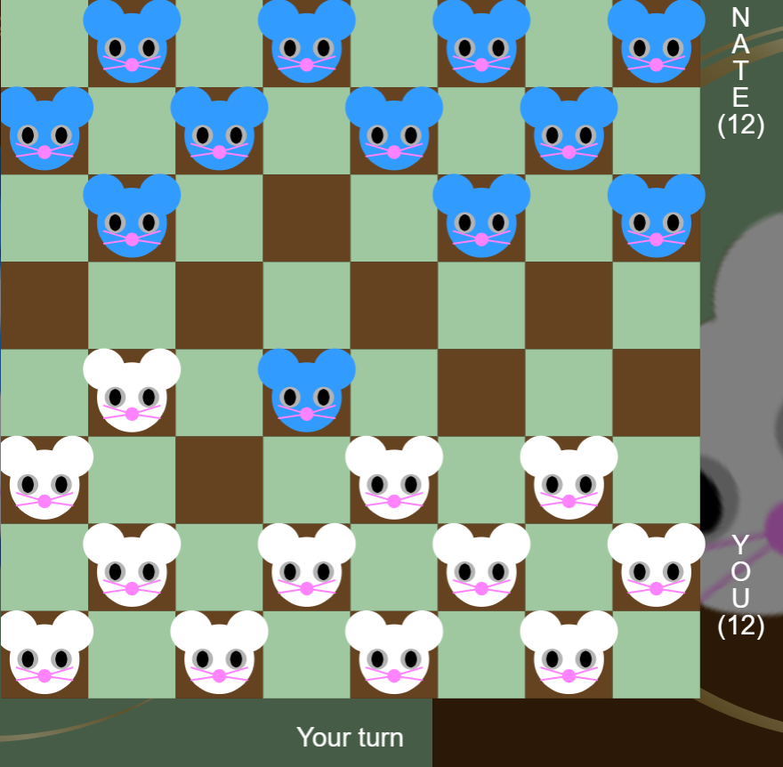

# Animal Checkers
Animal Checkers is a web-based checkers game with an animal theme. In this game, the user plays against an opponent robot. All the pieces represent animals, hence it being animal-themed.

 

## Rules
Rules of this game are a superset of standard [English checkers rules](https://en.wikipedia.org/wiki/English_draughts#:~:text=Move%20rules,-There%20are%20two&text=Uncrowned%20pieces%20can%20move%20diagonally,opponent%27s%20piece%20front%20and%20back%20%29.).
Other than general English checkers rules, additional rules are:
<ul>  
	<li>Four levels/ranks of animals in this game [rat, cat, dog, lion] -
   (ranks in ascending order).</li>  
	<li>Lions are the kings.</li>  
	<li>All pieces initially start at rat level.</li>
	<li>When a piece jumps an opponent piece, it raises in rank, unless it is a
   dog piece (a piece cannot turn into a lion/king by merely jumping; it must
   reach the other side to do so).</li>
		<ul>  
			<li>Example: Rat => Cat => Dog => Dog</li>
			<li> <b>NOTE:</b> When a dog piece jumps an opponent piece,  it remains as a dog piece.</li>
		</ul>
	<li>A piece that is not a lion/king turns into a lion/king when
   it reaches the opponent side of the board.</li>  
		<ul>  
			<li>Examples:</li>
			<ul>  
				<li>Rat => Lion (When piece reaches opposite side of board)</li> 
				<li>Cat => Lion (When piece reaches opposite side of board)</li> 
				<li>Dog => Lion (When piece reaches opposite side of board)</li> 
			</ul> 
		</ul>  
</ul>
